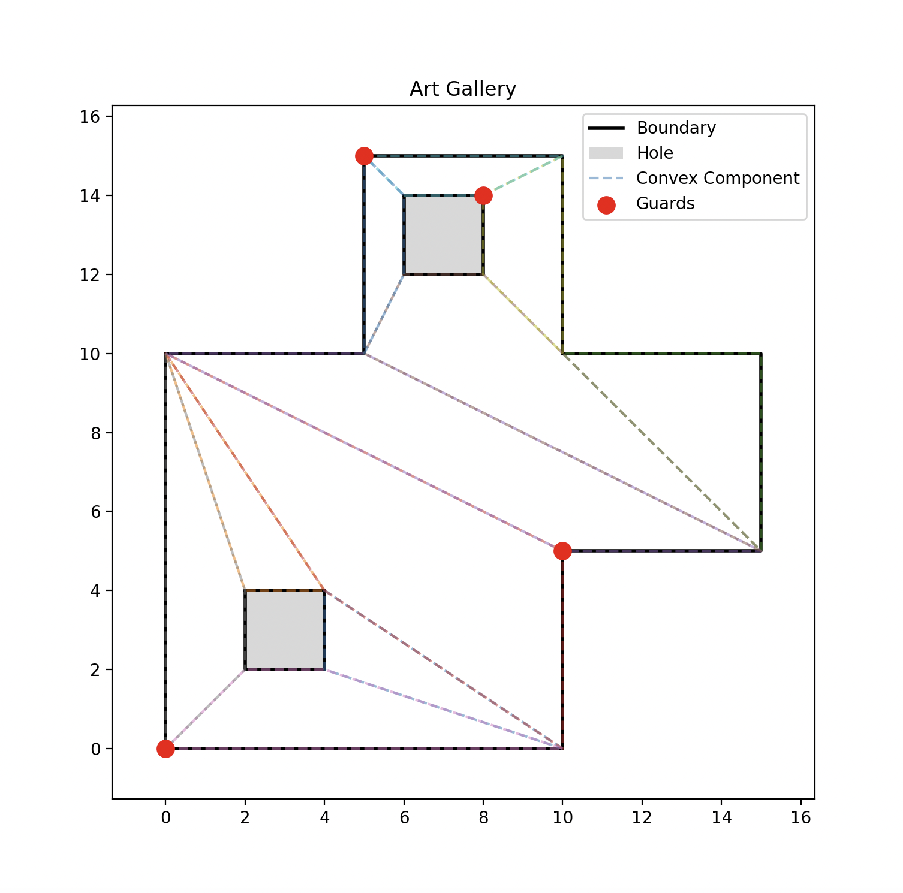
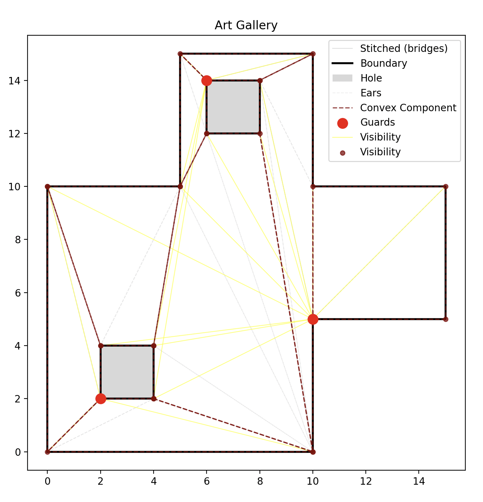
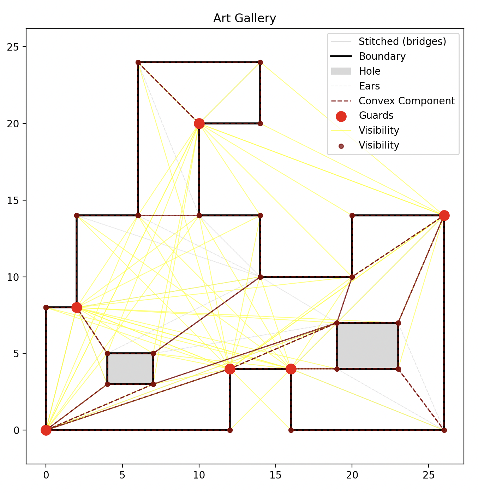
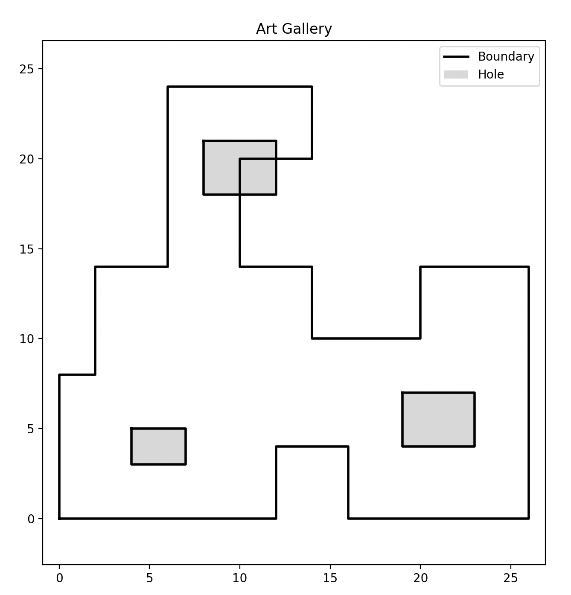
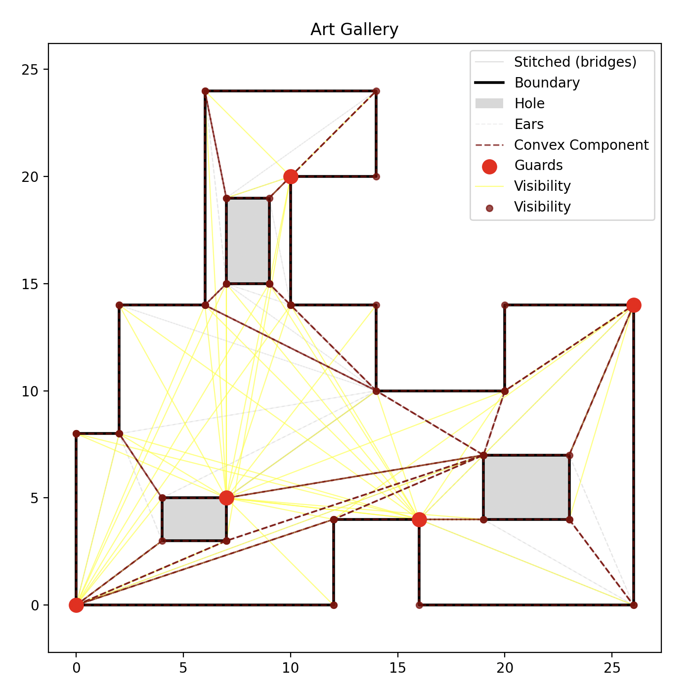
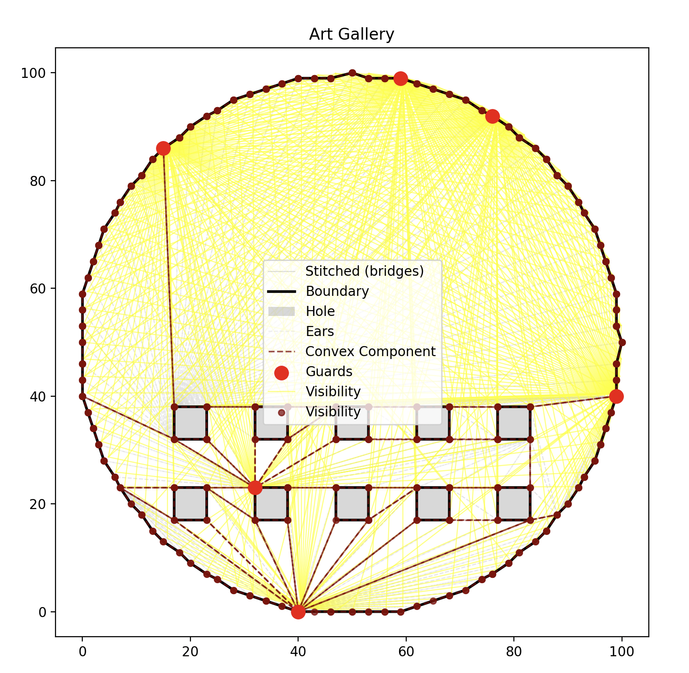
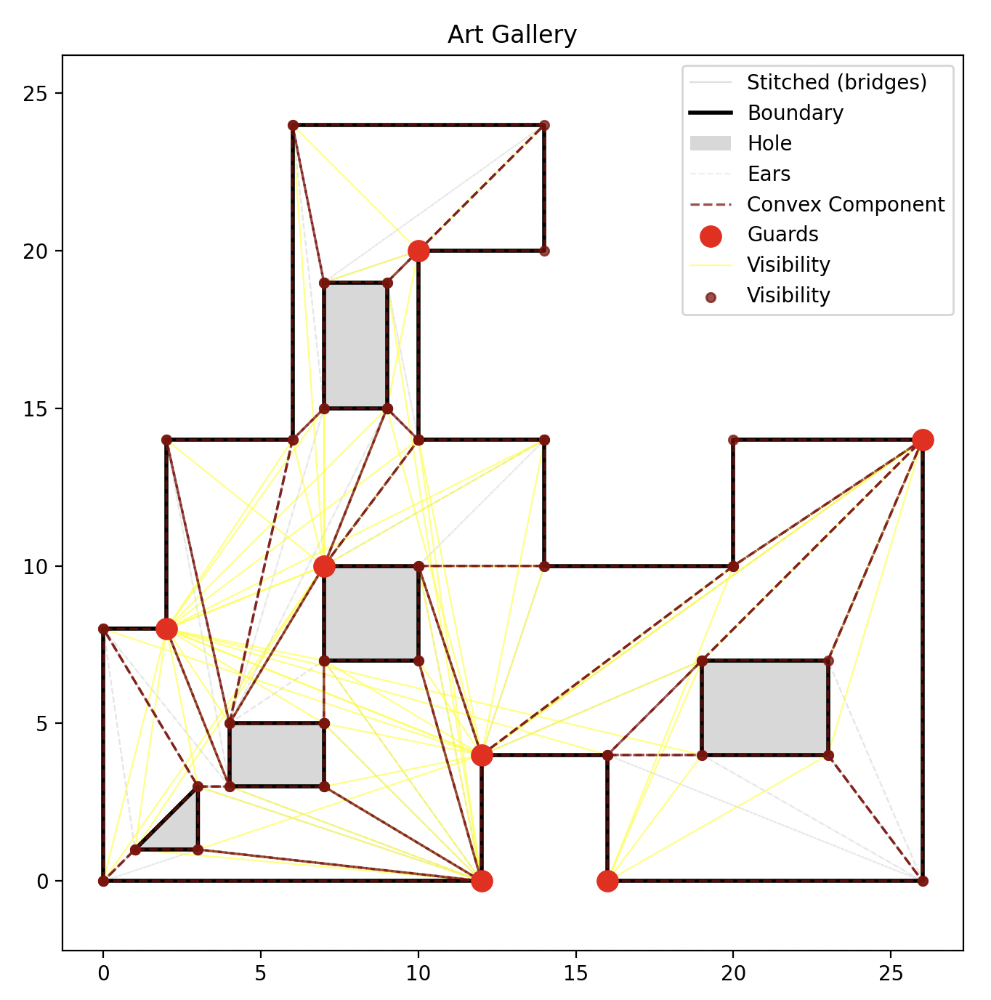
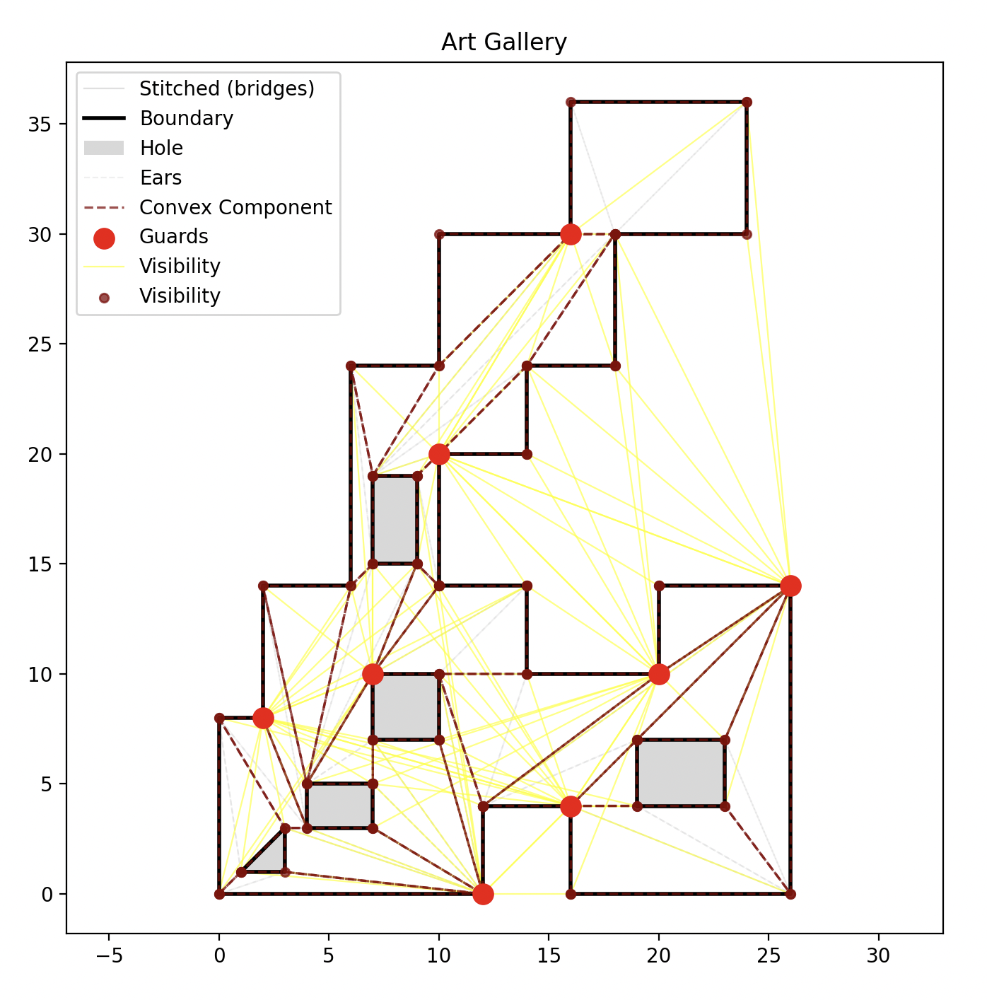
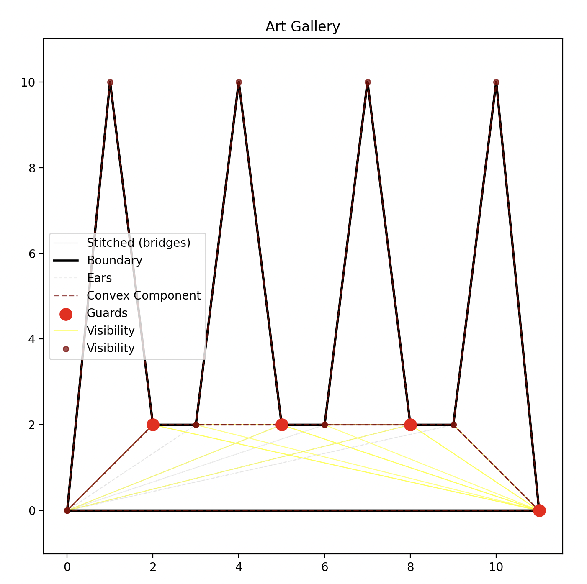
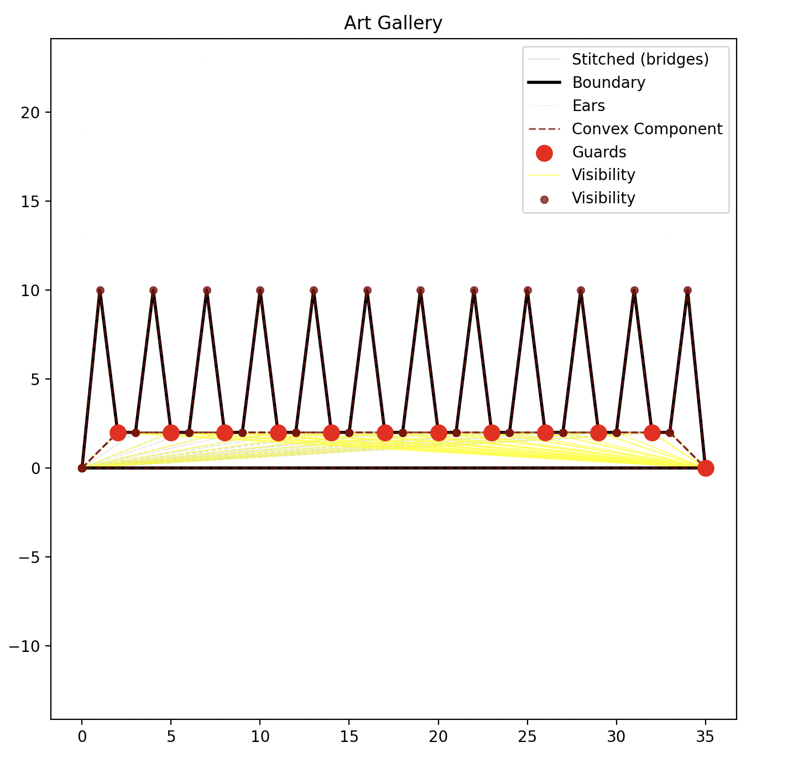

# geometry.martincastroalvarez.com

Computational geometry project: art gallery algorithms, convex decomposition, and guard placement from first principles.

## Documentation by area

| Area | Description | Readme |
|------|-------------|--------|
| **Lab** | Python prototype, examples, and art gallery pipeline | [lab/README.md](lab/README.md) |
| **API** | REST and worker backend (Lambda, S3, SQS, repositories, indexes) | [api/README.md](api/README.md) |
| **Web** | React app and shared frontend packages (see project structure below) | [docs/3 methodology/4 FRONTEND.md](docs/3%20methodology/4%20FRONTEND.md) |

## Project structure

| Path | Description |
|------|-------------|
| **apps/web** | SPA app shell: routing, layout, nav; composes providers (React Query, locale, analytics) and pages (Home, Jobs, Job, Gallery, Editor). |
| **packages/analytics** | Google Analytics: `AnalyticsProvider`, `useAnalytics()`, `track`, actions/categories enums; constants for default label and env key. |
| **packages/data** | Data layer: API clients (auth, geometry), React Query hooks (session, jobs, galleries), adapters API ↔ domain. |
| **packages/domain** | Pure domain: entities (Point, Polygon, ArtGallery, User, Job, Gallery, ConvexComponent, Ear, Guard) and invariants. |
| **packages/editor** | Polygon editor: Konva-based Editor, Toolbar, vertex/edge interaction; adapters to/from domain polygons. |
| **packages/i18n** | Localization: Language enum, LocaleProvider, useLocale, persisted locale, JSON translations (EN/ES). |
| **packages/ui** | Design system: layout (Body, Container, Nav), typography (Title, Text), Button, Toggle, Toaster, etc.; Tailwind. |
| **api/** | Backend: REST handlers, S3/SQS, repositories, indexes, worker Lambda; see [api/README.md](api/README.md). |
| **lab/** | Python prototype and example scripts for art gallery pipeline; see [lab/README.md](lab/README.md). |
| **tests/** | API tests (pytest); run with `pnpm run build:api:pytest` or `pnpm run build:api:coverage`. |

## Lab examples

The [lab](lab/) directory contains a Python prototype and example galleries. Each example builds an art gallery (polygon with holes), runs the pipeline (stitched boundary, ear-clipping triangulation, convex components, guards), and can be visualized (save the figure as `exampleN.png`).

| | |
|---|---|
|  |  |
|  |  |
|  |  |
|  |  |
|  |  |

## API test coverage

Backend coverage (pytest, `pnpm run build:api:coverage`). Required minimum 90%.

```
Name                             Stmts   Miss  Cover   Missing
--------------------------------------------------------------
api/__init__.py                      2      0   100%
api/api/__init__.py                  7      0   100%
api/api/handler.py                  49      4    92%   56-59
api/api/interceptor.py              47      0   100%
api/api/request.py                  29      0   100%
api/api/response.py                 24      0   100%
api/api/urls.py                     11      0   100%
api/attributes/__init__.py          19      0   100%
api/attributes/countdown.py         32      0   100%
api/attributes/email.py             22      0   100%
api/attributes/identifier.py        19      0   100%
api/attributes/limit.py             18      0   100%
api/attributes/offset.py            13      0   100%
api/attributes/origin.py            14      0   100%
api/attributes/path.py              26      0   100%
api/attributes/receipt.py           13      0   100%
api/attributes/signature.py         19      0   100%
api/attributes/slug.py              16      0   100%
api/attributes/timestamp.py         55      0   100%
api/attributes/url.py               20      0   100%
api/data/__init__.py                 6      0   100%
api/data/page.py                    16      0   100%
api/data/response.py                17      0   100%
api/enums/__init__.py                6      0   100%
api/enums/action.py                 15      0   100%
api/enums/method.py                 17      0   100%
api/enums/orientation.py             6      0   100%
api/enums/status.py                 16      0   100%
api/exceptions.py                   70      5    93%   78, 111, 123, 156, 200
api/geometry/__init__.py            10      0   100%
api/geometry/box.py                 62      2    97%   57, 61
api/geometry/convex.py              12      0   100%
api/geometry/ear.py                 18      1    94%   26
api/geometry/interval.py            73      0   100%
api/geometry/point.py               85      1    99%   18
api/geometry/polygon.py            174     78    55%   49, 70-76, 79-94, 97, 102-118, 123, 125-132, 138-161, 163-175
api/geometry/segment.py             93      2    98%   67, 165
api/geometry/walk.py                39      0   100%
api/indexes/__init__.py              6      0   100%
api/indexes/gallery.py              10      0   100%
api/indexes/indexed.py              21      4    81%   38, 42-44
api/indexes/jobs.py                 10      0   100%
api/interfaces/__init__.py           6      0   100%
api/interfaces/bounded.py           11      2    82%   12, 22
api/interfaces/measurable.py         9      1    89%   19
api/interfaces/serializable.py      13      0   100%
api/interfaces/spatial.py           11      2    82%   18, 23
api/interfaces/volume.py            10      1    90%   23
api/logger.py                       18      0   100%
api/messages/__init__.py             3      0   100%
api/messages/message.py             31      6    81%   37, 39, 41, 43, 46, 55
api/models/__init__.py               5      0   100%
api/models/base.py                 27      1    96%   47
api/models/gallery.py               46      4    91%   61, 64, 68, 83
api/models/user.py                 68      3    96%   71, 74, 77
api/mutations/__init__.py           4      0   100%
api/mutations/base.py               20      2    90%   29, 33
api/mutations/private.py            19      1    95%   29
api/mutations/request.py            14      0   100%
api/mutations/response.py          32      0   100%
api/mutations/utils.py               6      1    83%   14
api/queries/__init__.py              5      0   100%
api/queries/base.py                 25      0   100%
api/queries/galleries.py            21      3    86%   41-43
api/queries/private.py              19      1    95%   29
api/queries/request.py              12      0   100%
api/queries/response.py             13      0   100%
api/repositories/__init__.py         6      0   100%
api/repositories/gallery.py         12      1    92%   30
api/repositories/jobs.py            10      0   100%
api/repositories/results.py         19      2    89%   35, 38
api/structs/__init__.py              3      0   100%
api/tasks/__init__.py                8      0   100%
api/tasks/base.py                   19      3    84%   35-37
api/tasks/request.py                7      0   100%
api/tasks/response.py               16      0   100%
api/workers/__init__.py             4      0   100%
api/workers/response.py             25      0   100%
api/workers/urls.py                 8      0   100%
--------------------------------------------------------------
TOTAL                             1822    131    93%
Required test coverage of 90% reached. Total coverage: 92.81%
```

## Build, deploy, and test

### Prerequisites

- **Node.js** 20+ (LTS recommended; e.g. `nvm use 20` or `nvm use 22`) and **pnpm** (`npm install -g pnpm`).
- **Python** 3.12+ and **Poetry** (for the API and tests).
- **AWS CLI** configured with a profile (deploy uses `AWS_PROFILE='martin'`).
- **Secrets:** `./spy.sh martin com.martincastroalvarez.secrets GOOGLE_ANALYTICS_ID` (and optionally `JWT_TEST`) must succeed for `build:web:with-tag` and `deploy`.

### Commands (from project root)

- **Install and bootstrap:** `pnpm run init` (installs deps and bootstraps CDK; uses AWS profile `martin`). Use `pnpm run update` to only install dependencies.
- **Dev (web app):** `pnpm run dev` (Art Gallery editor at http://localhost:5174 with hardcoded Google Tag ID).
- **Build:** `pnpm run build` (runs `build:api` and `build:cdk`). Use `pnpm run build:api` or `pnpm run build:cdk` for specific parts. Use `pnpm run build:web` for the web app, or `pnpm run build:web:with-tag` to bake in Google Analytics ID from secrets.
- **Build all (for deploy):** `pnpm run build:all` (API + CDK + web app with Google Tag).
- **Deploy:** `pnpm run deploy` (update → build:all → CDK deploy → CloudFront invalidation via `pnpm run publish`).
- **Publish (invalidation only):** `pnpm run publish` (invalidates CloudFront using `GeometryDistributionId` from `outputs.json`).
- **Test:** `pnpm run test` (runs `test:lab`). Use `pnpm run test:lab:1` … `pnpm run test:lab:10` for `lab/example1.py` … `lab/example10.py`.
- **Logs (API Lambda):** `pnpm run logs:api` — prints the last 100 CloudWatch log events for `geometry-api-handler` (uses `AWS_PROFILE='martin'`).
- **Logs (worker Lambda):** `pnpm run logs:worker` — prints the last 100 CloudWatch log events for `geometry-worker-handler` (uses `AWS_PROFILE='martin'`).

### Deploy steps (what `pnpm run deploy` does)

1. `pnpm run update` — install Python (Poetry) and Node (pnpm) dependencies.
2. `pnpm run build:all` — API (black, isort, flake8, pytest, coverage), CDK TypeScript → `app.js`, web app build with Google Tag.
3. `AWS_PROFILE='martin' pnpm exec cdk deploy --require-approval never --all` — deploy CDK stacks.
4. `pnpm run publish` — CloudFront invalidation for the geometry site.

If deploy fails: fix any `build:api` (e.g. dataclass field order, tests) or `build:cdk` (e.g. TypeScript/Node) errors first, then run `pnpm run build:all` and `cdk deploy` again.
