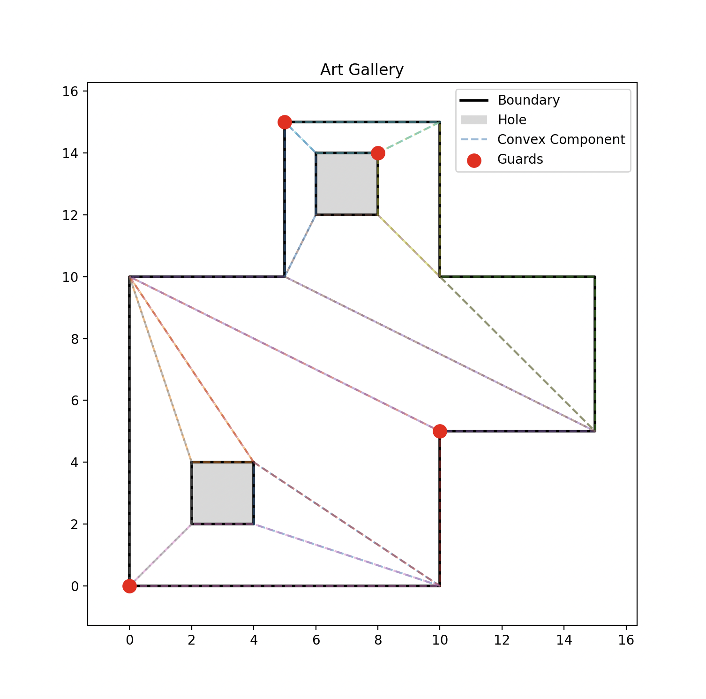
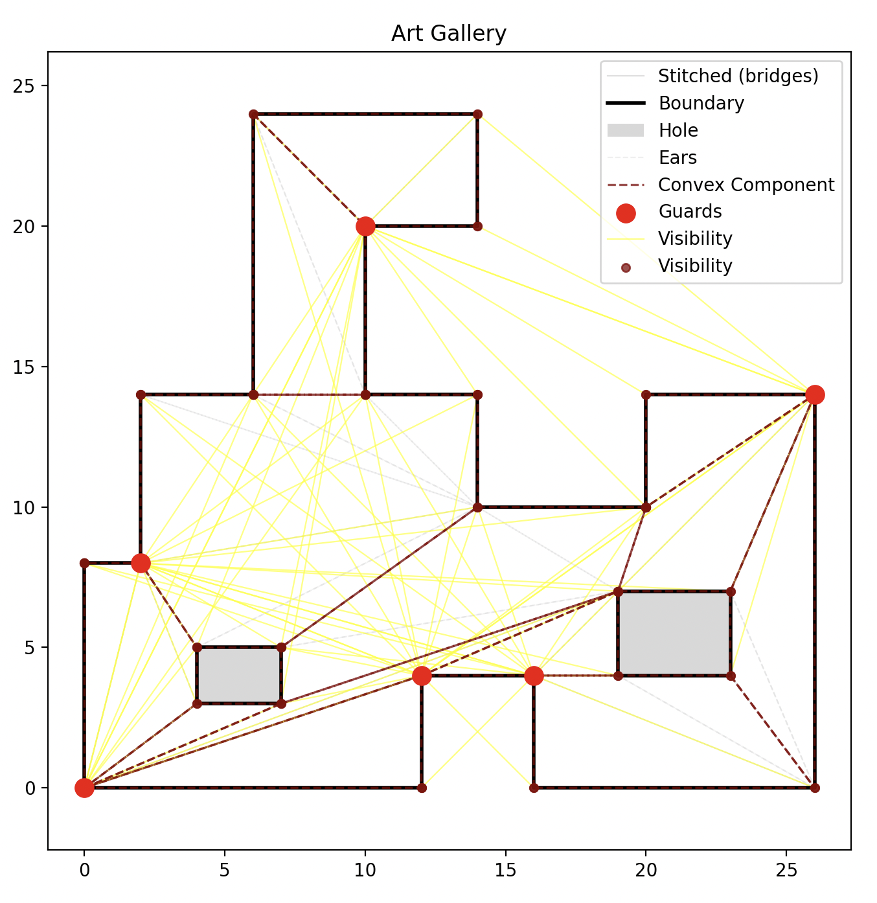
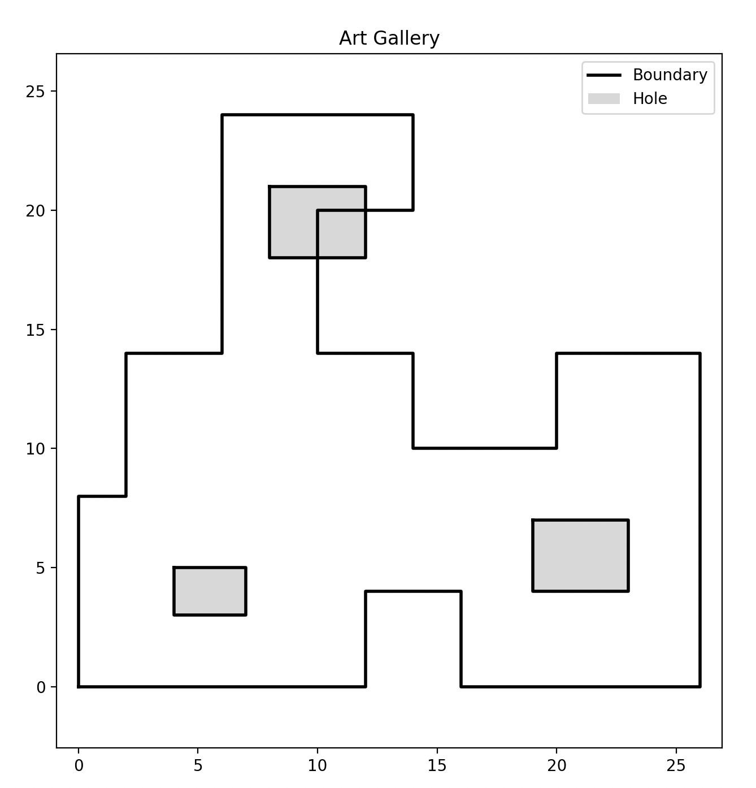
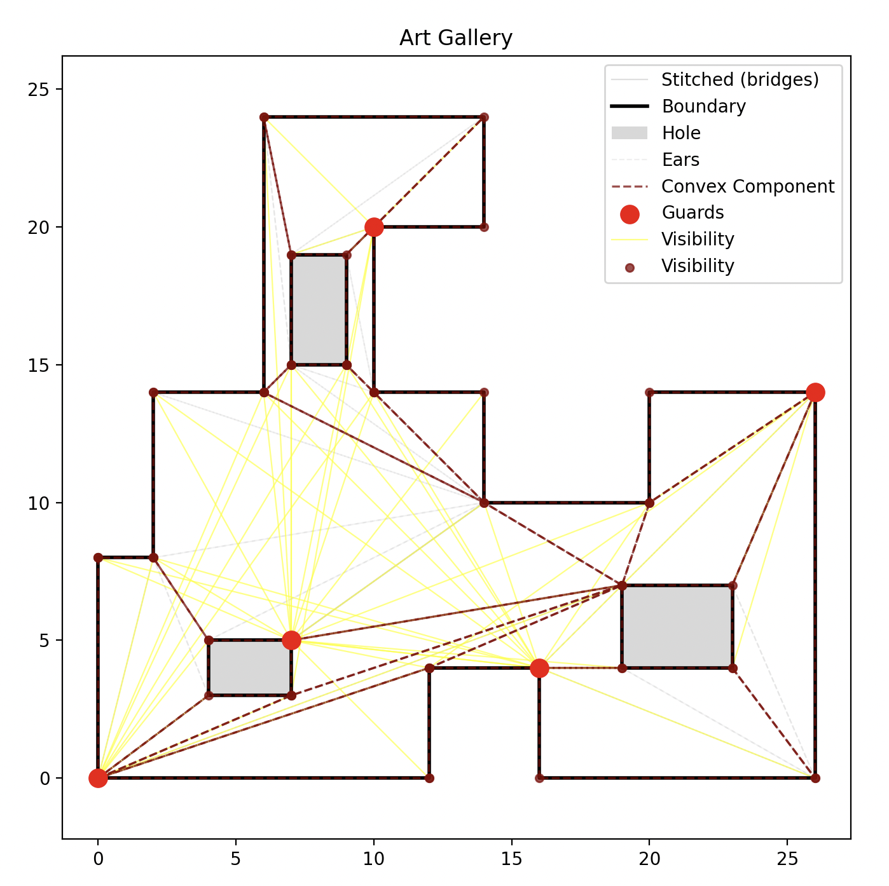
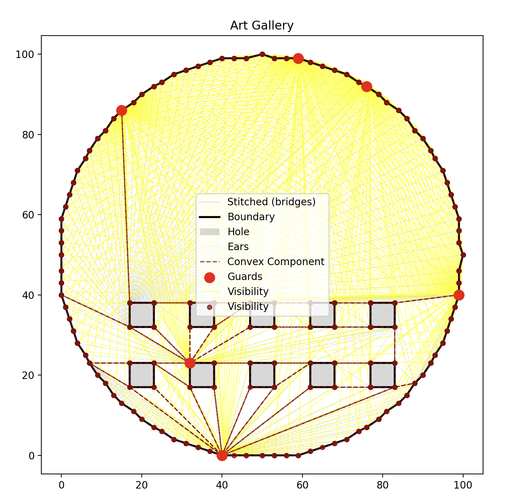

# Computational Geometry Lab

A computational geometry library and playground for implementing art gallery algorithms from first principles.

## Purpose

- **Art Gallery Problem**: Optimal guard placement in polygonal galleries with holes
- **Convex decomposition**: Merge ears into convex components via shared edges
- **Visibility**: Which components each guard sees (polygon + hole boundaries only; bridges do not block sight)

## Implementation Philosophy

- Explicit orientation (Path) and segment intersection tests
- Point-in-polygon and segment containment built from ray casting and predicates
- No external geometry libraries (no shapely, CGAL, sympy)
- Correctness and clarity over performance

## Requirements

- Python ≥ 3.13
- Dependencies managed with Poetry at the project root

## Folder contents

| Type | Files |
|------|--------|
| **Core** | `point.py`, `segment.py`, `sequence.py`, `path.py`, `polygon.py`, `triangle.py`, `box.py`, `interval.py`, `matrix.py`, `element.py`, `model.py`, `exceptions.py`, `convex.py`, `guard.py`, `visibility.py`, `art.py`, `designer.py` |
| **Examples** | `example1.py`, `example2.py`, `example3.py`, `example4.py`, `example5.py`, `example6.py` (and corresponding `exampleN.png` screenshots) |
| **Other** | `README.md`, `run.sh`, `pyproject.toml`, `poetry.lock`, `.gitignore` |

## Modules

| Module | Contents |
|--------|----------|
| `point.py` | `Point`, `PointSequence` (vertices, signed area, CCW/CW, convexity, edges as `SegmentSequence`, unique, slice, append/insert/pop) |
| `segment.py` | `Segment`, `SegmentSequence`, `SegmentSet` (size, midpoint, connects, intersects, immutable set with `smallest`/`largest` that raise when empty) |
| `sequence.py` | Re-exports `PointSequence` from `point` |
| `path.py` | `Path` (three points), `Orientation` (collinear/cw/ccw), signed area and orientation predicates |
| `polygon.py` | `Polygon` (simple, no duplicate points, non-zero area), edges as `SegmentSequence` |
| `triangle.py` | `Triangle`, `Ear` (convex ear for clipping), edges as `SegmentSequence` |
| `box.py` | `Box`, `Bounded`; axis-aligned bounds and containment |
| `interval.py` | `Interval` (1D), containment and overlap |
| `matrix.py` | `Matrix` (2×2 determinant for orientation/area) |
| `element.py` | `Element`, `ComplexElement`, `Element1D`, `Element2D` (contains, overlaps, size, signed_area) |
| `model.py` | `Model` (UUID), `ModelMap[T]` (dict-like, `clone()`, add/pop) |
| `exceptions.py` | Art-gallery and geometry-specific exceptions |
| `convex.py` | `ConvexComponent` (convex polygon, merge by shared edge, CCW) |
| `guard.py` | `Guard`, `VertexGuard` (guard with `vertex` = position) |
| `visibility.py` | `Visibility[T]` (guard → set of components or points, `sees`, `best`) |
| `art.py` | `ArtGallery` (holes, stitched boundary, ears, convex components, guards, post-process) |
| `designer.py` | `Designer` (takes `art_gallery`, `plot()` for matplotlib figure: boundary, holes, ears, convex components, guards, visibility) |

## Art Gallery Pipeline

1. **Boundary**: CCW polygon; holes are CW. Validated on construction.
2. **Points**: Stitched boundary (polygon + holes connected by minimal bridges). Bridges avoid crossing edges and sliding along boundary.
3. **Ears**: Ear-clipping triangulation on the stitched polygon.
4. **Convex components**: Ears merged by shared edges into maximal convex polygons (`ModelMap[ConvexComponent]`).
5. **Guards**: Greedy visibility (pick guard that sees the most remaining components); then a post-process removes redundant guards by comparing each guard’s visible points to the union of the others’.
6. **Visibility**: Point-based visibility on the stitched boundary for the final guard set.

## Running

From the project root:

```bash
poetry install
poetry run python lab/example1.py
```

Use `example2.py`, `example3.py`, `example4.py`, `example5.py`, or `example6.py` in place of `example1.py` to run other examples. Each script prints perimeter vertices, convex component count, guard count, and uses `Designer(art_gallery=gallery).plot()` to open a matplotlib window (save as `exampleN.png` to capture the figure).

## Examples

## Example 1 ([example1.py](example1.py))



## Example 2 ([example2.py](example2.py))


## Example 3 ([example3.py](example3.py))



## Example 4 ([example4.py](example4.py))



## Example 5 ([example5.py](example5.py))



## Example 6 ([example6.py](example6.py))


